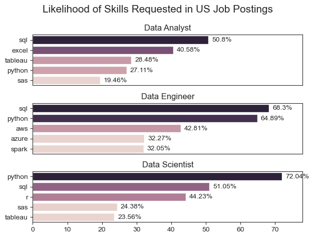
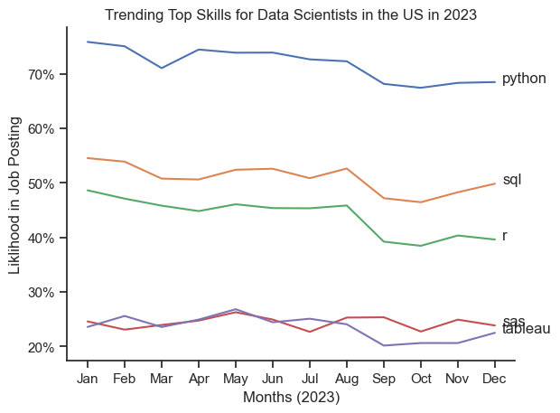
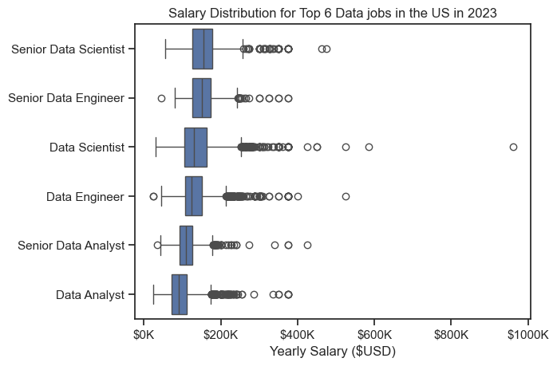
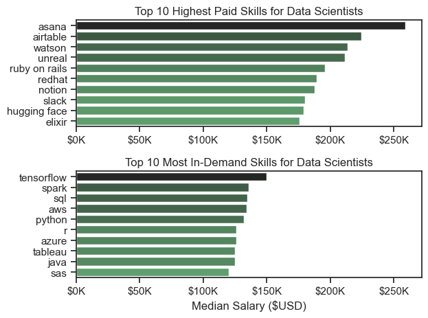
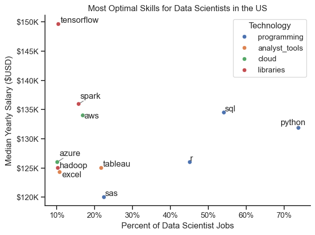

# The Analysis

## 1. What are the most demanded skills for the 3 most popular data jobs?

As a recent Data Science graduate looking for full time roles, I was curious to find information about the most in demand skills for popular data science jobs. To answer this question, I looked into the top 5 skills for the top 3 most popular data jobs in the US in 2023. This query highlights not only what the most popular data jobs are, but also shows me what skills I should highlight when applying to these roles.

View my notebook with detailed steps here:
[Skill_Demand.ipynb](notebooks/Skill_Demand.ipynb)

### Visualize Data 

```python
#Create plot
fig, ax = plt.subplots(len(job_titles), 1)
sns.set_style(style='ticks')

#Visualize plot
for i, job_title in enumerate(job_titles):
    df_plot = df_US_skills_perc[df_US_skills_perc['job_title_short'] == job_title].head(5)
    sns.barplot(data=df_plot, x='skill_percent', y='job_skills', ax=ax[i], hue='skill_count')
    #Label/Format plot
    ax[i].set_title(job_title)
    ax[i].set_ylabel('')
    ax[i].set_xlabel('')
    ax[i].legend().remove()
    ax[i].set_xlim(0, 78)
    
    for n, v in enumerate(df_plot['skill_percent']):
        ax[i].text(v + 1, n, f'{(v)}%', va='center')
        
    if i != len(job_titles) - 1:
        ax[i].set_xticks([])

fig.suptitle('Likelihood of Skills Requested in US Job Postings', fontsize=15)
fig.tight_layout()
plt.show()
```

### Results

*Three seperate bar charts showcasing top 5 most in-demand skills for top 3 most popular data jobs in the US in 2023*

### Insights

* Looking at the visualization, I can see that Python and SQL are highly versatile skills that are in demand for Data Analysts, Data Engineers, and Data Scientist. It is especially prominent for Data Scientist and Data Engineer roles, which makes sense given they are more "technical" roles.
* Data visualization skills, especially using Tableau seems to be especially important for Data Analysts as well as Data Scientist. This again, makes sense given that those roles typically work closely with business stakeholders and need to communicate data-driven insights.
Lastly, for Data Engineers, technical skills revolving around cloud computing such as azure and spark are quite popular given that Data Engineers typically are responsible for maintaining large data pipeliness across different storage systems.

## 2. How are skills trending for Data Scientists in the US?

As someone who is most interested in Data Scientist roles, I was curious to see how demand for popular skills trend over time over in the US job market in 2023. In terms of methodology I needed to do the following:

1. Aggregate skill counts per month
2. Calculate skill percentage based on total of jobs
3. Plot the monthly skill demand

Once I've cleaned the data and visualized it on a plot, I'd be able to see how demand for popular skills trend over time!

View my notebook with detailed steps here:
[Skills_Trend.ipynb](notebooks/Skills_Trend.ipynb)

### Visualize Data

```python
#Get top 5 most popular skills
df_plot = df_DS_US_perc.iloc[:, 0:5]

#Create plot
sns.set_theme(style='ticks')
sns.lineplot(data=df_plot, dashes=False)
sns.despine()

#Label plot
plt.title('Trending Top Skills for Data Scientists in the US in 2023')
plt.ylabel('Liklihood in Job Posting')
plt.xlabel('Months (2023)')
plt.legend().remove()

from matplotlib.ticker import PercentFormatter
ax = plt.gca()
ax.yaxis.set_major_formatter(PercentFormatter())

for i in range(5):
    plt.text(11.2, df_plot.iloc[-1, i], df_plot.columns[i])

plt.show()
```

### Results


*Line chart visualizing the demand of top skills for Data Scientists in the US in 2023*

### Insights

 * Out of all the skills, Python seems to remain the most popular throughout the year and stayed at a steady demand.
* SQL and R follow closly after which goes to show that knowing a programming language is quite important for this role.
* It is also interesting to note that SQL had a significant increase in demand near the end of the year, which might suggest that more companies are using more database/cloud technologies which require the need for Data Scientists with expereince querying languages.
* Lastly, Tableau and SAS are in the lower demand of skills, but remain at a steady rate. This might indicate that maybe only certain industries/companies have a need for those skill sets.

## 3. How well do Data jobs play in the US?

As someone who is early in their Data Science career, I was curious to see what roles within Data pay the most. This would give me an insight as to what roles are most in demand right now, and can also point towards roles that are growing in popularity.

View my notebook with detailed steps here:
[Salary_Analysis.ipynb](notebooks/Salary_Analysis.ipynb)

### Visualize Data

```python
#Create plot
sns.set_theme(style='ticks')

#Visualize plot
sns.boxplot(data=df_US_top6, x='salary_year_avg', y='job_title_short', order = job_order)

#Label plot
plt.title('Salary Distribution for Top 6 Data jobs in the US in 2023')
plt.xlabel('Yearly Salary ($USD)')
plt.ylabel('')
ticks_x = plt.FuncFormatter(lambda y, pos: f'${int(y/1000)}K')
plt.gca().xaxis.set_major_formatter(ticks_x)

plt.show()
```

### Results


*Salary Range for Top 6 Data jobs in the US in 2023*

### Insights

* From my visualization, I'm able to see that Data Scientists/Data Engineers get paid the most in the data field. It's also important to note that there is a significant variation in salary for Data Scientist/Data Engineer jobs with some salaries reaching $1 million! This goes to show that these jobs may vary in salary based on years of experience and level of technical skills


* On the other hand, Data Analyst jobs are on the lower paying end of the spectrum relative to other Data jobs. However, their salary ranges are much more consistent, with fewer outliers. This may be because of Data Analyst's typically need less technical skills and thus may have a lower base pay as well as less variance in salary range.

* Lastly, Senior roles, especially Senior Data Scientist and Senior Data Engineers get paid the most in the industry with a median annual salary of $155,000 and $150,000 respectively in the US in 2023. This again shows how years of experience and level of technical skills are generously rewarded in the industry.

## 4. How well do companies pay Data Scientists for certain skills?

During my analysis, I was also curious to see what technical skills were the most popular, as well as what skills were the paid the highest. This would help me in my journey as a Data Scientist, because it will give me a better idea on what skills I should up-level and what new skills I need to pick up.

View my notebook with detailed steps here:
[Salary_Analysis.ipynb](notebooks/Salary_Analysis.ipynb)

### Visualize Data

```python
#Create plot
fig, ax = plt.subplots(2, 1)
sns.set_theme(style='ticks')

#Visualize plot
sns.barplot(data=df_DS_US_top_paid_skills, x='median_salary', y=df_DS_US_top_paid_skills.index, hue='median_salary', ax=ax[0], palette='dark:g_r')
sns.barplot(data=df_DS_US_top_popular_skills, x='median_salary', y=df_DS_US_top_popular_skills.index, hue='median_salary', ax=ax[1], palette='dark:g_r')

#Label plot
ax[0].set_title('Top 10 Highest Paid Skills for Data Scientists')
ax[0].set_ylabel('')
ax[0].set_xlabel('')
ax[0].xaxis.set_major_formatter(plt.FuncFormatter(lambda x, _: f'${int(x/1000)}K'))
ax[0].legend().remove()

ax[1].set_title('Top 10 Most In-Demand Skills for Data Scientists')
ax[1].set_ylabel('')
ax[1].set_xlabel('Median Salary ($USD)')
ax[1].set_xlim(ax[0].get_xlim()) # Set the same x-axis as the first plot
ax[1].xaxis.set_major_formatter(plt.FuncFormatter(lambda x, _: f'${int(x/1000)}K'))
ax[1].legend().remove()

plt.tight_layout()
plt.show()
```

### Results

 
*Two seperate bar graphs visualizing the highest paid skills and the most in-demand skills for Data Scientists in the US in 2023*

* The top graph shows specialized technical skills like `Airtable`, `Unreal`, `Ruby`, and `Redhat`. However, there are also very popular business/project management platforms such as `Notion`, `Slack`, and `Asana`. These skills are correlated with increased salary, some of them which reach up to $250,000. This indicates that having a fluent understanding of business/project management tools and specific industry experience can lead to an increase in earning potential.

* The bottom graph highlights the most in-demand skills which happen to be foundational ones that are staple across the industry. These skills include popular programming languages like `Python` and `SQL` but also include popular ML packages like `Tensorflow` as well as cloud technologies such as `Spark` and `Azure`. This shows that in order to become a strong Data Scientists, I need to have a solid foundation in programming, machine learning, and cloud computing.

* Analyzing both the graphs together, we can see that there is a clear difference between the most popular skills and the highest paid skills. Data Scientists who are looking to maximize their career in terms of salary potential should look into developing not only a strong foundation in core skills, but also be well versed in business/project management tools in order to work efficiently with business stakeholders as well as gain exposure in more specialized skills for certain industries. 

## 5. What is the most optimal skill to learn as a Data Scientist?

Building upon the previous question, now that I know what the most popular and highest paid skills are, I was curious to find what the most "optimal" skills would be. Where "optimal" skills are determined by skills that are both highly in-demand and highly paid. In order to find this I needed to do the following: 

1. Group skills to determine median salary and likelihood of being in a job posting
2. Visualize median salary vs percent of demand for skills
3. Determine if certain technologies are more prevalent

View my notebook with detailed steps here:
[Optimal_Skills.ipynb](notebooks/Optimal_Skills.ipynb)

### Visualize Data

```python
#Visualize plot
sns.scatterplot(
    data=df_plot,
    x='skill_percent',
    y='median_salary',
    hue='technology'
)

#Prepare texts for adjustText
texts = []
for i, txt in enumerate(df_DS_skills_high_demand.index):
    texts.append(plt.text(df_DS_skills_high_demand['skill_percent'].iloc[i], 
                          df_DS_skills_high_demand['median_salary'].iloc[i],
                          txt))
    
#Adjust text to avoid overlap
adjust_text(texts, arrowprops=dict(arrowstyle='->', color='gray'))

#Label plot
plt.title('Most Optimal Skills for Data Scientists in the US')
plt.xlabel('Percent of Data Scientist Jobs')
plt.ylabel('Median Yearly Salary ($USD)')
plt.legend(title='Technology')

sns.despine()
sns.set_theme(style='ticks')

ax=plt.gca()
ax.yaxis.set_major_formatter(plt.FuncFormatter(lambda y, pos: f'${int(y/1000)}K'))
ax.xaxis.set_major_formatter(PercentFormatter(decimals=0))

plt.tight_layout()
plt.show()
```

### Results

 
*Most optimal skills for Data Scientists in the US in 2023*

### Insights

* The scatter plot above shows that most of the `programming` skills are both highly in-demand AND highly paid. Indicating that these skills are not only foundational, but highly needed as a Data Scientist.

* Machine Learning packages such as `Tensorflow` appear as one of the the highest paid skill but appear in less than 10% of job postings which indicate that it might be a specialized skill that is highly paid for certain companies/industries. 

* Cloud related technologies seem to rank second in terms of most optimal tools. Skills such as `Apache Spark`, `Azure`, and `Hadoop` are all skills related to big data and cloud computing that seem to be highly paid. 

* Lastly, the overall spread of these skills, and especially the lack of skills in the upper right corner of the graph (which indicates highly paid and highly in demand) showcases that there are not a lot of specific skills that are highly sought after and highly rewarded for Data Scientists. This indicates that the skillsets of Data Scientists will vary across different job postings, companies, and industries, and thus make it hard for a Data Scientist to pick a group of "optimal" skills they should pick up and learn.